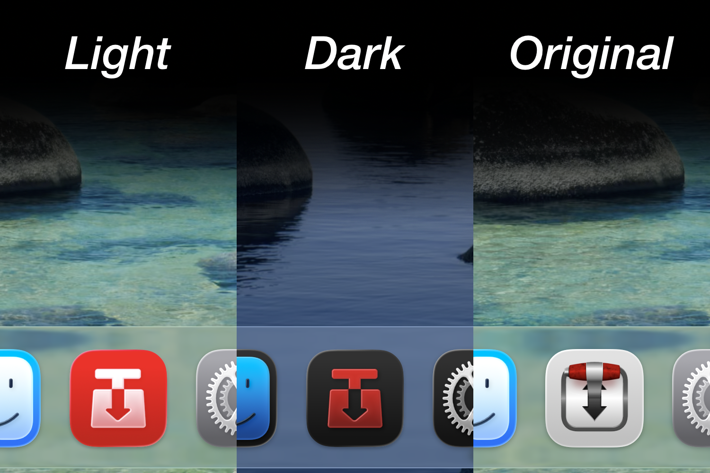

# Transmission Liquid Glass Icon

A Liquid Glass icon designed for [Transmission](https://www.transmissionbt.com) to fit macOS 26's Liquid Glass aesthetic. Simple and consistent with the new Tahoe style. No unflattering gray squircle and no Big Sur-era 3D shading.

  

Color reference and general visual direction take inspiration from the [Transmission icon used in Linux Mint's Mint-Y theme](https://github.com/linuxmint/mint-y-icons/blob/96559032abbe87325d25a37df69202d5d1005e40/src/apps/transmission.svg).

## Assets

- **`.icon` File (macOS 26+)**
  Native Liquid Glass icon with automatic light/dark switching. Intended for maintainers or anyone building Transmission from source. Crucially, this cannot be applied through Finder’s Get Info menu.
  
* **Raw PNGs**
Original 1024x1024 renders without padding or shadow, exported directly from Apple's Icon Composer. Not suitable for directly replacing the app icon as it renders too large in the Dock and app switcher.

* **Padded PNGs**
Scaled down to fit and match other apps in the Dock and app switcher. Does not have a shadow like other app icons.

* **Padded Shadow PNGs**
Padded and has a shadow. Closely matches other Liquid Glass app icons. Recommended for direct icon replacement.

## Installation (for PNG format)

1. Open the Applications folder.
2. Right click Transmission.app → Get Info.
3. Drag the PNG onto the icon preview in the top-left corner  
4. Close the Info window and relaunch Transmission if needed.

## License — CC0 1.0 Universal
This work is released into the public domain.   Use, modify, or redistribute without restriction.

Attribution is appreciated, but not required.

Created by Johann Goza